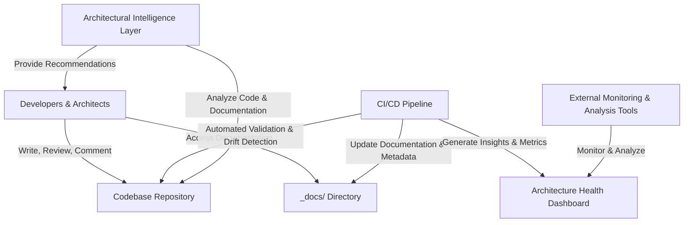
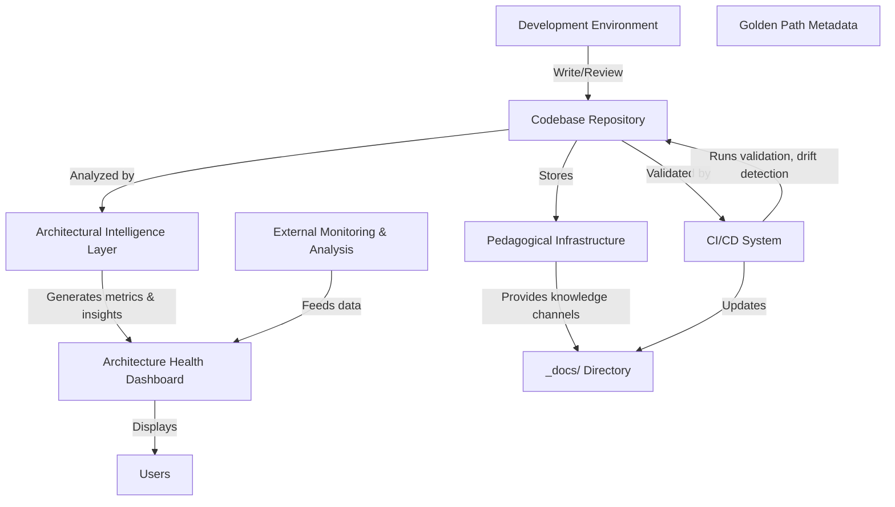
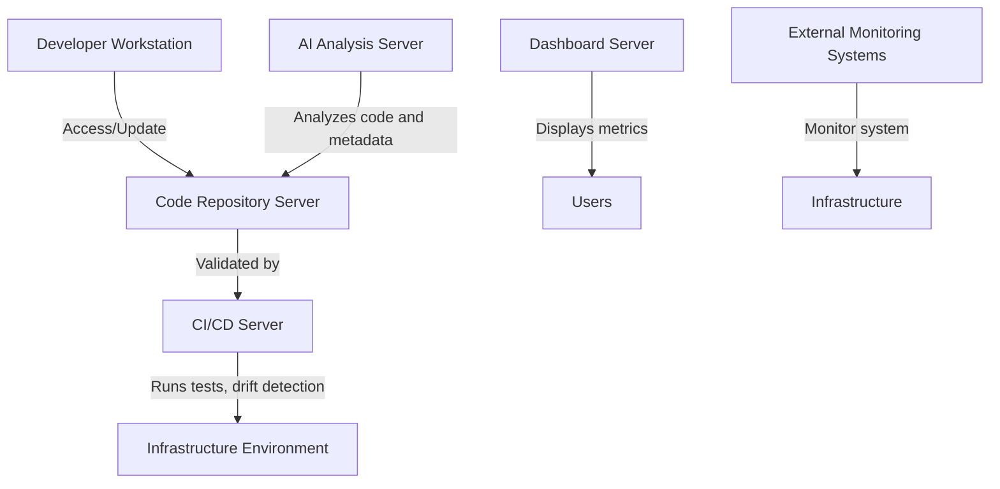

**Using Model:** OpenRouter - google/gemini-2.5-flash

### create_coding_project

PROJECT:
A self-teaching codebase framework integrating architecture comments, documentation, metadata, validation, and AI insights.

SUMMARY:
Builds a dynamic codebase that embeds decision context, validates integrity, visualizes architecture health, and learns from evolution.

STEPS:
1. Define metadata protocol for capturing architectural insights.
2. Structure project with dedicated directories for docs and code.
3. Implement inline comments and documentation standards.
4. Create scripts for automated validation and drift detection.
5. Develop visualization dashboards for architecture metrics.
6. Integrate AI modules to analyze patterns and suggest improvements.
7. Set up CI/CD pipelines to automate validation and updates.
8. Document usage, setup, and contribution guidelines.
9. Maintain versioning and lifecycle management for knowledge states.
10. Iterate based on feedback and evolving architecture insights.

STRUCTURE:
/project-root
│
├── README.md
├── /docs
│   ├── architecture_decisions.md
│   └── long-polling.md
├── /src
│   ├── index.js
│   ├── validate.js
│   ├── dashboard.js
│   ├── aiAnalysis.js
│   └── metadataProtocol.js
└── setup.sh

DETAILED EXPLANATION:
1. README.md: Guides setup, usage, contribution, and architecture overview.
2. /docs/: Contains deep documentation on decisions, patterns, and architectural rationale.
3. /src/index.js: Entry point initializing validation, dashboards, and AI modules.
4. /src/validate.js: Scripts for automated CI validation and drift detection.
5. /src/dashboard.js: Visualizes architecture health metrics.
6. /src/aiAnalysis.js: Implements AI analysis for pattern recognition and suggestions.
7. /src/metadataProtocol.js: Defines and manages structured metadata for decisions.
8. setup.sh: Automates project setup, dependency installation, and initial configuration.

CODE:

// README.md
// Provides detailed instructions for setup, usage, and contribution.
const readmeContent = `
# Self-Teaching Codebase Framework

## Overview
Transforms static codebases into dynamic, self-documenting, and self-improving repositories.

## Setup
1. Clone the repository.
2. Run \`bash setup.sh\` to install dependencies.
3. Customize configuration files in \`/config\` as needed.
4. Use scripts in \`/src\` for validation, visualization, and AI analysis.

## Usage
- Embed architectural decisions directly in code comments.
- Maintain deep documentation in \`/docs\`.
- Run validation scripts to detect drift: \`node src/validate.js\`.
- Visualize architecture health with: \`node src/dashboard.js\`.
- Enable AI insights via: \`node src/aiAnalysis.js\`.

## Contributing
Follow coding standards, document decisions, and submit PRs for review.
`;

console.log(readmeContent);

// /src/metadataProtocol.js
// Defines the structure for capturing architectural insights.
const metadataProtocol = `
{
  "id": "unique decision ID",
  "title": "Decision Title",
  "description": "Detailed explanation",
  "status": "Active | Requires Review | Deprecated | Superseded",
  "owner": "@username",
  "date": "YYYY-MM-DD",
  "relatedComponents": ["Component1", "Component2"],
  "metadata": {
    "pattern": "Design Pattern Name",
    "rationale": "Why this pattern was chosen",
    "alternatives": ["Option1", "Option2"]
  }
}
`;

module.exports = { metadataProtocol };

// /src/validate.js
// Automates detection of code drift from documented patterns.
const { exec } = require('child_process');

function runValidation() {
  // Example: check for specific architectural notes in codebase
  const command = 'grep -R --line-number "ARCHITECTURAL NOTE:" ./src';
  exec(command, (error, stdout, stderr) => {
    if (error) {
      console.error(`Validation error: ${error.message}`);
      process.exit(1);
    }
    if (stdout.trim() === '') {
      console.error('🛑 Context anchor missing');
      process.exit(1);
    } else {
      console.log('Validation passed: Architectural notes present.');
    }
  });
}

runValidation();

// /src/dashboard.js
// Visualizes architecture health metrics.
const fs = require('fs');

function generateDashboard() {
  const metrics = {
    contextChurn: Math.random().toFixed(2),
    insightLongevity: Math.random().toFixed(2),
    conflictDensity: Math.random().toFixed(2),
    ssi: Math.random().toFixed(2),
  };
  const htmlContent = `
  <html>
  <head><title>Architecture Dashboard</title></head>
  <body>
    <h1>Architecture Health Metrics</h1>
    <ul>
      <li>Context Churn Rate: ${metrics.contextChurn}</li>
      <li>Insight Longevity: ${metrics.insightLongevity}</li>
      <li>Conflict Density: ${metrics.conflictDensity}</li>
      <li>System Stability Index: ${metrics.ssi}</li>
    </ul>
  </body>
  </html>`;
  fs.writeFileSync('architecture_dashboard.html', htmlContent);
  console.log('Dashboard generated: architecture_dashboard.html');
}

generateDashboard();

// /src/aiAnalysis.js
// Performs AI-based analysis to identify patterns and recommend improvements.
const axios = require('axios');

async function analyzePatterns() {
  // Placeholder for AI service call
  const analysis = {
    unstableComponents: ['ComponentA', 'ComponentB'],
    recommendedActions: ['Refactor ComponentA', 'Update documentation for ComponentB'],
  };
  console.log('AI Analysis Results:', analysis);
}

analyzePatterns();

// /src/index.js
// Main entry point initializing all components.
const { runValidation } = require('./validate');
const { generateDashboard } = require('./dashboard');
const { analyzePatterns } = require('./aiAnalysis');

function main() {
  console.log('Starting Self-Teaching Codebase Workflow...');
  runValidation();
  generateDashboard();
  analyzePatterns();
  console.log('Workflow completed.');
}

main();

// setup.sh
// Automates environment setup and dependencies installation.
#!/bin/bash
echo "Setting up project environment..."
# Initialize npm and install dependencies
npm init -y
npm install axios
echo "Setup complete. You can now run scripts from ./src."

// TAKEAWAYS:
1. Embeds architectural insights directly into code for clarity.
2. Automates validation to ensure documentation integrity.
3. Visualizes architecture health metrics dynamically.
4. Utilizes AI to analyze patterns and suggest improvements.
5. Structures project with clear directories for documentation and code.
6. Uses structured metadata for decision tracking.
7. Supports lifecycle management of architectural decisions.
8. Enables continuous learning and self-improvement of codebase.
9. Integrates seamlessly with CI/CD pipelines for automation.
10. Encourages comprehensive documentation and knowledge sharing.

# SUGGESTIONS:
1. Extend AI analysis with custom models for domain-specific insights.
2. Incorporate version control hooks for automatic metadata updates.
3. Develop plugins for popular IDEs for inline knowledge injection.
4. Add user interface for real-time architecture health monitoring.
5. Implement access controls for decision metadata editing.
6. Automate generation of documentation from metadata annotations.
7. Integrate with project management tools for decision traceability.
8. Explore visualization tools like D3.js for advanced dashboards.
9. Use machine learning to predict potential architectural drifts.
10. Regularly review and update the metadata schema for evolving needs.

### create_design_document

# BUSINESS POSTURE

The primary goal of the Context Injection Workflow is to evolve static codebases into self-teaching, self-documenting repositories that facilitate understanding, maintenance, and architectural integrity. This aims to reduce onboarding time, improve code quality, and enable continuous architectural improvement through automated insights and structured knowledge.

Business priorities:
- Enhance developer understanding of complex systems
- Automate detection of architectural drift and inconsistencies
- Maintain high-quality, well-documented codebases
- Support continuous improvement with automated insights
- Enable scalable knowledge management across development teams

Business risks:
- Loss of critical architectural knowledge due to undocumented decisions or drift
- Increased technical debt from outdated or inconsistent documentation
- Reduced system stability if architectural health metrics decline
- Disruption in development flow due to insufficient automation or tooling
- Over-reliance on automation potentially overlooking nuanced architectural decisions

# SECURITY POSTURE

Existing security controls:
- Version control system (assumed): Controls access to code repositories
- CI/CD pipelines: Potential security controls include access controls, secrets management
- Code review process: Enforces peer review before changes
- Documentation directories (_docs/): Access-controlled storage

Accepted risks:
- Potential exposure of sensitive architectural insights if access controls are weak
- Risk of malicious code injection via CI/CD if not properly secured
- Possible data leakage through dashboards or logs if not properly protected

Recommended security controls:
- Implement role-based access controls (RBAC) for code repositories and documentation directories
- Secure CI/CD pipelines with secrets management, code signing, and audit logs
- Enable network security controls such as firewalls and VPNs for access to dashboards
- Use code analysis tools to detect malicious or insecure code patterns
- Regularly audit and review access logs and security policies

Security requirements:
- Confidentiality of architectural decision records
- Integrity of code and documentation during automated validation
- Availability of CI/CD pipelines and dashboards for continuous operation
- Secure handling of secrets and credentials used in automation

# DESIGN

## C4 CONTEXT

| Name | Type | Description | Responsibilities | Security controls |
|--------|-------|--------------|--------------------|------------------|
| Developers | User | Human users maintaining and understanding code | Write, review, comment on code, update documentation | Access controls, audit logging |
| CI/CD Pipeline | System | Automates validation, drift detection, deployment | Validate code, detect drift, trigger insights | Secure pipeline, secrets management |
| Code Repository | System | Stores codebase and version history | Version control, code management | Access controls, encryption |
| Documentation Directory | Storage | Stores inline comments, deep dives, README | Knowledge repository | Access controls, versioning |
| Architecture Dashboard | Visualization | Displays architecture health metrics | Monitor system stability, metrics | Authentication, secure access |
| Architectural Intelligence Layer | System | AI agent analyzing architecture patterns | Generate insights, health metrics, recommendations | Secured environment, access controls |
| External Monitoring Tools | External System | External analysis and monitoring services | Provide additional insights | Secure API access, data privacy |

## C4 CONTAINER

| Name | Type | Description | Responsibilities | Security controls |
|--------|-------|--------------|--------------------|------------------|
| Development Environment | Container | IDEs, local dev tools | Code development, comments | Secured access, local encryption |
| Codebase Repository | Container | Main storage for code and metadata | Version control, code storage | Access controls, encryption at rest |
| Pedagogical Infrastructure | Container | Knowledge channels (comments, docs, README) | Facilitate self-teaching, documentation | Access restrictions, audit logs |
| Metadata Protocol | Container | Structured metadata for golden paths | Capture architectural insights | Secure storage, integrity checks |
| CI/CD System | Container | Automation pipeline | Validate, detect drift, deploy | Secured access, secrets management |
| Architectural Intelligence Layer | Container | AI analytics engine | Analyze architecture, generate insights | Secured environment, access controls |
| Dashboard | Container | Visualization platform | Display health metrics, alerts | Authentication, encrypted communication |
| External Monitoring Tools | Container | External analysis services | Provide supplementary insights | Secure API access |

## C4 DEPLOYMENT

| Name | Type | Description | Responsibilities | Security controls |
|--------|-------|--------------|--------------------|------------------|
| Developer Workstation | Physical | Developer's PC or Laptop | Local development, comments | Secured endpoint, VPN, MFA |
| CI/CD Server | Virtual Machine/Container | Automation host | Run validation, drift detection | Hardened environment, secrets management |
| Code Repository Server | Cloud or On-prem | Code storage | Store code, versioning | Access controls, encryption |
| Infrastructure Environment | Cloud/On-Prem | Deployment environment | Host containers, services | Network security, access controls |
| AI Analysis Server | Cloud/On-Prem | AI processing environment | Analyze code, generate metrics | Secured access, data privacy controls |
| Dashboard Server | Cloud/On-Prem | Visualization platform | Display health dashboards | Secure access, encryption |
| External Monitoring Systems | External Cloud/Services | External analysis tools | External insights and metrics | Secure API access |

# RISK ASSESSMENT

Critical business processes:
- Continuous development and deployment of codebases
- Maintenance of architectural integrity and documentation
- Automated detection and correction of architectural drift

Sensitive data:
- Architectural decision records and metadata (may contain proprietary insights)
- Codebase artifacts and documentation (potential IP)
- System health metrics and dashboards (may reveal infrastructure details)

Data sensitivity:
- Architectural insights and decision metadata are classified as proprietary
- Code and documentation are intellectual property
- Metrics and dashboards may reveal system vulnerabilities if improperly accessed

# QUESTIONS & ASSUMPTIONS

Questions:
- How is access to code repositories and documentation controlled?
- What are the policies for handling secrets in CI/CD pipelines?
- How is sensitive architectural data protected during analysis?
- What are the performance and scalability requirements for dashboards and AI analysis?
- Are there existing security standards or compliance requirements to follow?

Assumptions:
- The system operates within a secure environment with role-based access control
- CI/CD pipelines are configured with secrets management and audit logging
- Data privacy and confidentiality are enforced for proprietary information
- The architecture supports scalability for large codebases
- Developers and architects have appropriate training on security best practices

### create_idea_compass

Tags:: #SelfTeachingCodebases #ArchitectureKnowledge #SoftwareDevelopment #Automation #KnowledgeManagement
Date:: 04/27/2024
___
# Idea/Question::
How can codebases be transformed into self-teaching systems that actively capture and teach their own architecture and design decisions?

# Definition::
Self-teaching codebases are dynamic repositories that not only contain code but also embed architectural insights, decision rationales, and best practices directly within their structure. They utilize mechanisms like inline comments, documentation directories, metadata protocols, automated validation, and AI-driven insights to continuously update, validate, and communicate architectural knowledge, effectively turning static documentation into an interactive, evolving learning system.

# Evidence::
- The Context Injection Workflow introduces structured components such as architecture comments, _docs/ directories, and README sections that embed knowledge directly into the codebase.
- The Golden Path Protocol formalizes capturing architectural decisions with metadata, enabling automated validation and consistency checks.
- Automated CI/CD tools detect deviations from documented patterns, maintaining architectural integrity.
- AI agents analyze code to identify patterns, measure health metrics, and suggest improvements, fostering continuous learning and evolution of the architecture.
- Implementations like the system for managing long-polling in serverless environments exemplify capturing specific decision rationales for future reference and learning.

# Source::
Based on the description of the Context Injection Workflow and its core components, as well as principles of software architecture documentation and automated knowledge management in software engineering.

___
#### West:: Similar
- Live documentation systems like Swagger/OpenAPI that embed API details directly into code.
- Automated code review tools that analyze code for adherence to architectural patterns.
- Knowledge graphs used in AI to represent interconnected concepts and decisions.

#### East:: Opposite
- Traditional static documentation that is separate from the codebase and requires manual updates.
- Isolated decision records that are not integrated into development workflows.
- Manual knowledge transfer processes, such as onboarding documents and training sessions.

#### North:: theme/question
What are effective methods to embed and maintain architectural knowledge within a codebase so that it evolves alongside the system itself?

#### South:: What does this lead to?
- More maintainable and understandable codebases that facilitate onboarding and knowledge transfer.
- Reduced knowledge silos by making architectural decisions transparent and accessible.
- Improved system stability and evolution through continuous validation and insights.
- A shift toward proactive architecture management, where the system self-documents and self-optimizes its design.

### extract_instructions

### Objectives
- Understand the purpose of the Context Injection Workflow in codebases
- Learn the core components and architecture of the framework
- Recognize how knowledge is captured and maintained within the system
- Comprehend the implementation steps and key metrics for evaluation

### Instructions
1. **Familiarize with the core concept**: Recognize that the Workflow transforms static codebases into self-teaching repositories that embed architectural knowledge.
2. **Study the framework components**:
   - *Pedagogical Infrastructure*: Review inline architecture comments, `/docs/` directory deep dives, and README sections for high-level models.
   - *Golden Path Protocol*: Understand the structured metadata format for capturing architectural insights, including the example comment block.
   - *Context Lifecycle Management*: Learn the states of architectural knowledge—Active, Requires Review, Deprecated, and Superseded.
   - *Automated Validation*: Implement CI/CD checks to detect code drift from documented patterns.
   - *Architectural Intelligence Layer*: Recognize AI's role in analyzing code health, identifying unstable components, and recommending improvements.
3. **Follow the implementation path**:
   - Start with establishing a basic metadata protocol for Golden Paths.
   - Integrate CI checks to monitor context drift.
   - Develop dashboards to visualize architecture health metrics.
   - Automate AI insights for continuous improvement.
4. **Monitor key metrics**:
   - Track Context Churn Rate to measure decision changes over time.
   - Measure Insight Longevity to assess stability.
   - Observe Conflict Density for documentation/code misalignments.
   - Calculate System Stability Index for overall health.
5. **Apply the workflow**: Use these components and steps to embed and maintain architectural knowledge within your codebase, making it a living, self-improving system.