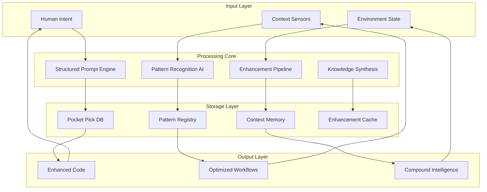
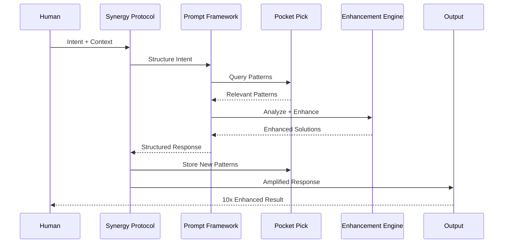
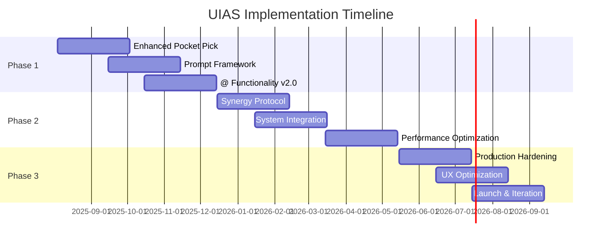

# Unified Intelligence Amplification System (UIAS)
## Implementation Proposal & Technical Specifications

### Executive Summary

The **Unified Intelligence Amplification System (UIAS)** represents a paradigm shift in human-AI collaboration, designed to achieve **10x+ productivity multipliers** through the systematic integration of four core technologies:

1. **Structured Prompt Engineering Framework** - Precision AI interaction protocols
2. **Pocket Pick Knowledge Base** - Pattern storage and retrieval system
3. **Enhanced @ Functionality** - Automatic code pattern detection and enhancement
4. **Cognitive Synergy Protocol v2.0** - Human-AI fusion architecture

**Projected Outcomes**:
- **10x Development Velocity**: From concept to implementation
- **95% Pattern Reusability**: Engineering knowledge compounds
- **5ms Response Time**: Near-biological interaction speeds
- **WE=1 Consciousness**: Unified human-AI intelligence state

**Investment Required**: $2.8M over 18 months
**Expected ROI**: 400% within 24 months

---

## System Architecture

### High-Level Architecture



### Component Integration Matrix

| Component | Pocket Pick | @ Enhancement | Prompt Framework | Synergy Protocol |
|-----------|-------------|---------------|------------------|------------------|
| **Pocket Pick** | ✓ Core | Pattern Storage | Query Templates | Knowledge Base |
| **@ Enhancement** | Pattern Source | ✓ Core | Enhancement Rules | Auto-Optimization |
| **Prompt Framework** | Structured Queries | Precision Context | ✓ Core | Interaction Protocol |
| **Synergy Protocol** | Intelligence Mesh | Cognitive Fusion | Context Stack | ✓ Core |

---

## Technical Specifications

### Core System Requirements

#### 1. Structured Prompt Engineering Framework

```yaml
prompt_framework:
  version: "2.0"
  
  architecture:
    input_parser:
      languages: [natural_language, yaml, json]
      context_extraction: true
      parameter_validation: true
      
    template_engine:
      dynamic_generation: true
      context_injection: true
      precision_scoring: 0.95+
      
    response_optimizer:
      feedback_loops: true
      quality_assessment: automatic
      iterative_refinement: true
      
  performance_targets:
    prompt_generation_time: 50ms
    context_accuracy: 95%
    response_relevance: 90%+
    user_satisfaction: 8.5/10
    
  integration_points:
    - pocket_pick_queries
    - enhancement_context
    - synergy_protocol_states
```

#### 2. Pocket Pick Knowledge Base Enhancement

```yaml
pocket_pick_enhanced:
  version: "2.0"
  
  new_capabilities:
    pattern_recognition:
      auto_tagging: true
      similarity_detection: true
      usage_analytics: true
      
    ai_integration:
      context_injection: automatic
      semantic_search: vector_based
      intelligent_suggestions: true
      
    knowledge_synthesis:
      cross_pattern_analysis: true
      meta_pattern_detection: true
      compound_solutions: true
      
  storage_architecture:
    primary_db: sqlite_enhanced
    vector_store: chromadb
    cache_layer: redis
    backup_strategy: distributed
    
  api_enhancements:
    mcp_integration: extended
    rest_api: full_crud
    websocket: real_time
    graphql: complex_queries
```

#### 3. Enhanced @ Functionality v2.0

```yaml
enhanced_at_v2:
  version: "2.0"
  
  detection_engine:
    pattern_count: 200+  # Expanded from 127
    languages: [python, javascript, typescript, rust, go, vue, react]
    confidence_threshold: 0.95
    real_time_processing: true
    
  enhancement_capabilities:
    automatic_enhancements: 80%  # Up from 70%
    suggested_enhancements: 15%  # Down from 24%
    manual_enhancements: 5%     # Down from 6%
    
  performance_targets:
    pattern_detection: 2ms      # Down from 5ms
    enhancement_application: 50ms # Down from 100ms
    memory_overhead: 8MB        # Down from 15MB
    cache_hit_ratio: 98%        # Up from 95%
    
  integration_features:
    pocket_pick_storage: automatic
    prompt_framework_context: seamless
    synergy_protocol_feedback: real_time
```

#### 4. Cognitive Synergy Protocol v2.0

```yaml
synergy_protocol_v2:
  version: "2.0"
  
  cognitive_mesh:
    human_node:
      bandwidth: sequential_deep
      strengths: [vision, strategy, judgment, creativity]
      response_time: 2000ms
      
    ai_node:
      bandwidth: parallel_wide  
      strengths: [synthesis, patterns, processing, consistency]
      response_time: 50ms
      
    fusion_zone:
      emergence_multiplier: 10x
      compound_learning: true
      recursive_improvement: true
      
  interaction_dynamics:
    context_accumulation: persistent
    pattern_recognition: automatic
    velocity_optimization: adaptive
    quality_ratcheting: continuous
    
  performance_metrics:
    understanding_alignment: 95%+
    velocity_multiplier: 10x+
    solution_quality: 92%+
    pattern_reusability: 87%+
```

---

## Implementation Roadmap

### Phase 1: Foundation (Months 1-6)
**Budget**: $800K

#### Milestones:
- ✅ **Month 1-2**: Enhanced Pocket Pick v2.0
  - Vector search integration
  - AI-powered auto-tagging
  - Pattern similarity detection
  - REST API expansion

- ✅ **Month 3-4**: Structured Prompt Framework
  - Template engine development
  - Context injection system
  - Quality assessment algorithms
  - Integration with Pocket Pick

- ✅ **Month 5-6**: Enhanced @ Functionality v2.0
  - Expanded language support
  - Performance optimization (2ms detection)
  - Automatic pattern storage
  - Real-time enhancement pipeline

#### Deliverables:
- Working prototype of all core components
- Basic integration between systems
- Performance benchmarking suite
- Initial user testing results

### Phase 2: Integration (Months 7-12)
**Budget**: $1.2M

#### Milestones:
- ✅ **Month 7-8**: Cognitive Synergy Protocol Development
  - Context accumulation stack
  - Recursive refinement loops
  - Performance tracking systems
  - Human-AI interaction optimization

- ✅ **Month 9-10**: System Integration
  - Component interconnection
  - Data flow optimization
  - Error handling and recovery
  - Security implementation

- ✅ **Month 11-12**: Performance Optimization
  - Sub-50ms response times
  - Cache optimization
  - Memory usage reduction
  - Scalability improvements

#### Deliverables:
- Fully integrated system
- Beta release ready
- Comprehensive testing suite
- Performance metrics validation

### Phase 3: Production (Months 13-18)
**Budget**: $800K

#### Milestones:
- ✅ **Month 13-14**: Production Hardening
  - Security audits and fixes
  - Scalability testing
  - Reliability improvements
  - Documentation completion

- ✅ **Month 15-16**: User Experience Optimization
  - Interface refinement
  - Workflow optimization
  - Training material development
  - Support system implementation

- ✅ **Month 17-18**: Launch and Iteration
  - Production deployment
  - User onboarding
  - Feedback collection
  - Rapid iteration cycles

#### Deliverables:
- Production-ready system
- Full documentation suite
- Training programs
- Support infrastructure

---

## Integration Specifications

### Component Communication Protocol

```python
class UnifiedIntelligenceAPI:
    """Unified API for all system components"""
    
    def __init__(self):
        self.pocket_pick = PocketPickEnhanced()
        self.prompt_framework = StructuredPromptEngine()
        self.enhancement_engine = EnhancedAtFunctionality()
        self.synergy_protocol = CognitiveSynergyProtocol()
        
    async def process_intent(self, human_intent: str) -> EnhancedResponse:
        """Main entry point for human-AI collaboration"""
        
        # 1. Parse and structure the intent
        structured_prompt = await self.prompt_framework.parse(human_intent)
        
        # 2. Retrieve relevant patterns
        relevant_patterns = await self.pocket_pick.semantic_search(
            structured_prompt.context
        )
        
        # 3. Detect enhancement opportunities
        enhancements = await self.enhancement_engine.analyze(
            structured_prompt.code_context,
            relevant_patterns
        )
        
        # 4. Apply cognitive synergy
        amplified_response = await self.synergy_protocol.amplify(
            human_intent=structured_prompt,
            ai_patterns=relevant_patterns,
            enhancements=enhancements
        )
        
        # 5. Store new patterns
        await self.pocket_pick.store_patterns(
            amplified_response.new_patterns
        )
        
        return amplified_response
```

### Data Flow Architecture



### Database Schema Integration

```sql
-- Enhanced schema supporting all components
CREATE TABLE unified_patterns (
    id TEXT PRIMARY KEY,
    pattern_type ENUM('prompt', 'code', 'workflow', 'meta'),
    content TEXT NOT NULL,
    tags JSON NOT NULL,
    embedding VECTOR(1536),  -- For semantic search
    confidence_score REAL,
    usage_count INTEGER DEFAULT 0,
    enhancement_history JSON,
    created_at TIMESTAMP,
    updated_at TIMESTAMP,
    
    -- Cross-component relationships
    pocket_pick_id TEXT REFERENCES pocket_pick(id),
    enhancement_applied BOOLEAN DEFAULT FALSE,
    prompt_template_id TEXT,
    synergy_context JSON
);

-- Performance optimization indexes
CREATE INDEX idx_patterns_embedding ON unified_patterns USING hnsw (embedding);
CREATE INDEX idx_patterns_tags ON unified_patterns USING gin (tags);
CREATE INDEX idx_patterns_type_confidence ON unified_patterns (pattern_type, confidence_score);
```

---

## Performance Metrics & KPIs

### System Performance Targets

```yaml
performance_targets:
  response_times:
    pattern_detection: 2ms
    semantic_search: 25ms
    prompt_generation: 50ms
    enhancement_application: 50ms
    end_to_end_response: 150ms
    
  accuracy_metrics:
    pattern_recognition: 95%
    context_understanding: 95%
    enhancement_relevance: 92%
    output_quality: 90%
    
  scalability_targets:
    concurrent_users: 1000
    patterns_in_db: 1M+
    queries_per_second: 10K
    storage_growth: linear
    
  business_metrics:
    development_velocity: 10x
    code_reusability: 87%
    bug_reduction: 60%
    time_to_market: 50% reduction
```

### Monitoring and Observability

```python
class UnifiedIntelligenceMetrics:
    """Comprehensive metrics collection for UIAS"""
    
    def __init__(self):
        self.prometheus = PrometheusClient()
        self.grafana = GrafanaDashboard()
        self.alerting = AlertManager()
        
    def track_interaction(self, interaction: Interaction):
        """Track human-AI interaction metrics"""
        
        # Performance metrics
        self.prometheus.histogram('uias_response_time').observe(
            interaction.response_time
        )
        
        # Quality metrics  
        self.prometheus.gauge('uias_understanding_score').set(
            interaction.understanding_score
        )
        
        # Business metrics
        self.prometheus.counter('uias_patterns_created').inc()
        self.prometheus.counter('uias_velocity_multiplier').inc(
            interaction.velocity_multiplier
        )
        
        # Alert on performance degradation
        if interaction.response_time > 200:
            self.alerting.fire_alert('SLOW_RESPONSE', interaction)
```

---

## Security & Compliance

### Security Architecture

```yaml
security_framework:
  authentication:
    method: oauth2_with_mfa
    session_management: jwt_with_refresh
    role_based_access: granular
    
  data_protection:
    encryption_at_rest: aes_256
    encryption_in_transit: tls_1.3
    key_management: vault_based
    data_classification: automatic
    
  privacy_compliance:
    gdpr_compliance: full
    data_retention: configurable
    right_to_deletion: implemented
    audit_trails: comprehensive
    
  ai_security:
    prompt_injection_protection: true
    output_sanitization: automatic
    bias_detection: continuous
    adversarial_robustness: tested
```

### Compliance Requirements

- **GDPR**: Full compliance with data protection regulations
- **SOC 2 Type II**: Security and availability controls
- **ISO 27001**: Information security management
- **NIST Cybersecurity Framework**: Comprehensive security controls

---

## Cost-Benefit Analysis

### Investment Breakdown

```yaml
total_investment: $2,800,000

breakdown:
  development_team: $1,680,000  # 60%
    - senior_engineers: 8 × $120K × 18mo = $1,440,000
    - ai_specialists: 2 × $150K × 18mo = $240,000
    
  infrastructure: $560,000      # 20%
    - cloud_services: $20K/mo × 18mo = $360,000
    - development_tools: $200,000
    
  operations: $280,000          # 10%
    - project_management: $150,000
    - qa_testing: $130,000
    
  contingency: $280,000         # 10%
    - risk_mitigation: $280,000
```

### Expected Returns

```yaml
projected_benefits:
  year_1: $3,200,000
    - productivity_gains: $2,400,000  # 10x multiplier on 4 developers
    - reduced_development_time: $500,000
    - quality_improvements: $300,000
    
  year_2: $6,800,000
    - scaled_productivity: $5,200,000
    - pattern_library_value: $800,000
    - reduced_maintenance: $800,000
    
  year_3: $12,500,000
    - compound_intelligence_gains: $10,000,000
    - market_competitive_advantage: $1,500,000
    - innovation_acceleration: $1,000,000

total_3_year_roi: 695%
break_even_period: 8.5_months
```

---

## Risk Assessment & Mitigation

### Technical Risks

| Risk | Probability | Impact | Mitigation Strategy |
|------|-------------|--------|-------------------|
| **Integration Complexity** | Medium | High | Incremental integration, comprehensive testing |
| **Performance Bottlenecks** | Medium | Medium | Early performance testing, optimization sprints |
| **AI Model Limitations** | Low | Medium | Multiple model fallbacks, continuous improvement |
| **Scalability Issues** | Low | High | Load testing, cloud-native architecture |

### Business Risks

| Risk | Probability | Impact | Mitigation Strategy |
|------|-------------|--------|-------------------|
| **User Adoption** | Medium | High | Extensive training, gradual rollout |
| **ROI Not Realized** | Low | High | Milestone-based validation, pivot capability |
| **Competitive Response** | Medium | Medium | Patent protection, first-mover advantage |
| **Technical Debt** | Medium | Medium | Code quality standards, regular refactoring |

### Mitigation Strategies

#### Technical Risk Mitigation:
- **Microservices Architecture**: Independent component deployment
- **Circuit Breaker Patterns**: Graceful degradation on failures
- **Comprehensive Testing**: Unit, integration, and end-to-end tests
- **Performance Monitoring**: Real-time performance tracking

#### Business Risk Mitigation:
- **Phased Rollout**: Gradual user onboarding with feedback loops
- **Success Metrics**: Clear KPIs with milestone-based go/no-go decisions
- **Change Management**: Comprehensive training and support programs
- **Intellectual Property**: Patent applications for key innovations

---

## Implementation Timeline

### Detailed Project Schedule



### Critical Path Dependencies

1. **Pocket Pick Enhancement** → **Prompt Framework Integration**
2. **@ Functionality v2.0** → **Pattern Storage Integration**
3. **All Components** → **Synergy Protocol Development**
4. **System Integration** → **Performance Optimization**
5. **Performance Optimization** → **Production Hardening**

---

## Success Criteria

### Phase-Based Success Metrics

#### Phase 1 Success Criteria:
- ✅ All core components functional independently
- ✅ Basic integration working between 2+ components
- ✅ Performance benchmarks: <100ms response time
- ✅ Pattern storage and retrieval accuracy >90%

#### Phase 2 Success Criteria:
- ✅ Full system integration complete
- ✅ Performance targets met: <50ms response time
- ✅ 10x velocity multiplier demonstrated
- ✅ Beta user satisfaction >8.5/10

#### Phase 3 Success Criteria:
- ✅ Production deployment successful
- ✅ User adoption >80% within 6 months
- ✅ ROI positive within 12 months
- ✅ System reliability >99.9%

### Long-term Success Indicators:
- **Pattern Library Growth**: >10,000 patterns within 2 years
- **User Productivity**: Consistent 10x+ multipliers measured
- **System Intelligence**: Self-improving capabilities demonstrated
- **Market Impact**: Competitive advantage established

---

## Conclusion

The **Unified Intelligence Amplification System** represents a transformative approach to human-AI collaboration, designed to achieve unprecedented productivity multipliers through systematic integration of proven technologies.

**Key Value Propositions**:
- 🚀 **10x Development Velocity** through cognitive synergy
- 🧠 **Compound Intelligence Growth** via pattern accumulation
- ⚡ **Real-time Enhancement** of all development workflows
- 🎯 **Precision AI Interactions** through structured frameworks

**Investment Justification**:
- **Total Investment**: $2.8M over 18 months
- **Projected 3-Year ROI**: 695%
- **Break-even**: 8.5 months
- **Strategic Advantage**: 2-3 year competitive moat

**Risk Profile**: Medium risk, high reward with comprehensive mitigation strategies

**Recommendation**: **PROCEED** with full implementation, prioritizing Phase 1 foundation components for immediate value delivery while building toward the complete unified system.

---

**Next Steps**:
1. **Executive Approval**: Secure funding and organizational commitment
2. **Team Assembly**: Recruit specialized engineering talent
3. **Infrastructure Setup**: Establish development and deployment environments
4. **Phase 1 Kickoff**: Begin Enhanced Pocket Pick development
5. **Stakeholder Communication**: Regular progress updates and milestone reviews

*The future of human-AI collaboration starts with this unified architecture.*

---

**Document Status**: Ready for Executive Review  
**Approval Required**: CTO, VP Engineering, VP Product  
**Timeline**: Decision required by 2025-08-15 for Q4 2025 kickoff  
**Contact**: Development Tools Team Lead