Greptile's memory system learns from every interaction with your team to deliver increasingly personalized and actionable code review suggestions.

## How Greptile Learns From Your Team

### 1. Reading Team Comments on PRs

Greptile observes patterns in your team's code review discussions:


**Examples of Learning:**
```
Team consistently comments: "Add error handling"
→ Greptile learns: Error handling is important to this team

Team often says: "This should be async"
→ Greptile learns: Team prefers async patterns

Team flags: "Move this to a service layer"
→ Greptile learns: Team follows layered architecture
```

### 2. Learning from Replies to Greptile

Your responses teach Greptile what matters:

<Tabs>
<Tab title="Positive Responses">
```
Greptile: "Consider extracting this logic into a utility function"
Developer: "Good catch! Will refactor this."
→ Greptile learns: Code organization suggestions are valued
```
</Tab>

<Tab title="Context-Setting Responses">
```
Greptile: "This function is quite long"
Developer: "In our domain layer, we prefer detailed functions for clarity"
→ Greptile learns: Length rules don't apply to domain logic
```
</Tab>

<Tab title="Dismissive Responses">
```
Greptile: "Consider adding JSDoc comments"
Developer: "We don't document internal utilities"
→ Greptile learns: Documentation rules vary by code type
```
</Tab>
</Tabs>

### 3. Learning from Reactions

Thumbs up/down reactions provide instant feedback on suggestion quality:

```mermaid
sequenceDiagram
    participant G as Greptile
    participant D as Developer
    participant M as Memory System
    
    G->>D: Makes suggestion
    D->>G: 👍 or 👎
    G->>M: Log reaction + context
    M->>G: Adjust future suggestions
```



## Learning Nitpickiness Levels

Greptile learns your team's tolerance for minor suggestions through commit analysis and reactions:

### Commit-Based Learning

Greptile analyzes which comments get addressed by comparing first and last commits:

```mermaid
graph TD
    A[Style Comment Made] --> B[PR Completed]
    B --> C{Comment Addressed?}
    C -->|Consistently No| D[Reduce Style Comments]
    C -->|Yes| E[Continue Suggesting]
    C -->|👎 Reaction| F[Suppress Comment Type]
```



### Adaptive Noise Filtering

**High Nitpick Team** (addresses style issues):
```
✅ Missing semicolons
✅ Import organization  
✅ Function naming
✅ Documentation gaps
```

**Low Nitpick Team** (ignores style issues):
```
❌ Missing semicolons (suppressed after 3 ignores)
❌ Import organization (team doesn't care)
✅ Security issues (always flagged)
✅ Logic errors (never suppressed)
```

### Learning Thresholds

```typescript
// Greptile tracks patterns like:
const learningData = {
  semicolonComments: { made: 10, addressed: 0, reactions: -3 },
  securityComments: { made: 5, addressed: 5, reactions: +4 },
  performanceComments: { made: 8, addressed: 6, reactions: +2 }
};

// Result: Stop semicolon comments, prioritize security
```

## Impact of Learning and Memory

### More Actionable Comments

Learning transforms generic suggestions into targeted, team-specific guidance:

**Before Learning (Generic):**
```
🤖 "Consider adding error handling"
🤖 "This function could be shorter"  
🤖 "Add documentation here"
🤖 "Fix indentation"
```

**After Learning (Personalized):**
```
🤖 "Add error handling using your team's Result<T> pattern"
🤖 "Consider breaking this into multiple domain methods (per your architecture)"
🤖 "Security validation missing - required for payment functions"
```

### Contextual Understanding

Greptile learns when rules apply and when they don't:

<Tabs>
<Tab title="Context-Aware Rules">
```typescript
// Greptile learns these patterns:
class PaymentService {
  // ✅ Long functions OK in domain logic
  processComplexPayment(data: PaymentData) {
    // 50+ lines of business logic - team accepts this
  }
}

// ❌ But flags long functions in utilities
function formatString(input: string) {
  // 20+ lines here would get flagged
}
```
</Tab>

<Tab title="Team-Specific Standards">
```python
# Team A: Prefers explicit error handling
def transfer_funds(amount, account):
    try:
        # explicit try/catch
    except Exception as e:
        # handle errors

# Team B: Prefers Result objects  
def transfer_funds(amount, account) -> Result[Transfer]:
    # return Success() or Failure()
```
</Tab>
</Tabs>

### Reduced Review Fatigue

Memory eliminates noise and focuses on what matters:


**Measurable Impact:**
- 80% reduction in ignored comments
- 3x higher suggestion adoption rate
- Faster PR review cycles
- Focus on architecture and logic over style

## Custom Rules Discovery

Greptile automatically infers custom rules from team behavior without manual configuration:

### Auto-Generated Rules

**From Team Comments:**
```
Observed pattern: Team always comments "Move DB calls to service layer"
→ Auto-generated rule: "Controllers should not contain direct database calls"

Observed pattern: Team consistently requests "Add input validation"  
→ Auto-generated rule: "API endpoints require input validation"
```

### Learning Evolution


**Evolution Timeline:**
- **Week 1-2**: Standard suggestions, high noise
- **Week 3-4**: Learning team preferences, filtering begins
- **Week 5-8**: Custom patterns emerge, suggestions improve
- **Week 9+**: Highly personalized, actionable recommendations

## Real-World Learning Examples

### Team A: Security-Focused Fintech

**Learning Journey:**
```
Month 1: Generic security suggestions ignored
Month 2: Team comments "We use our custom auth middleware"  
Month 3: Greptile learns to suggest team's auth patterns
Result: 90% suggestion adoption rate for security issues
```

### Team B: Performance-Obsessed Gaming

**Learning Journey:**
```
Week 1: Style comments get 👎 reactions
Week 3: Performance comments get 👍 reactions
Week 6: Greptile stops style suggestions, focuses on performance
Result: Faster reviews, better performance optimization
```

## Why Learning and Memory Matter

<Card title="Eliminates Noise" icon="volume-x" horizontal>
Learns to filter out suggestions your team consistently ignores
</Card>

<Card title="Builds Context" icon="brain" horizontal>
Understands your team's unique patterns and preferences
</Card>

<Card title="Improves Adoption" icon="trending-up" horizontal>
Higher suggestion acceptance leads to better code quality
</Card>

<Card title="Saves Time" icon="clock" horizontal>
Reduces back-and-forth discussions about irrelevant suggestions
</Card>

## The Learning Advantage

Traditional static analysis tools give the same generic suggestions to every team. Greptile's memory system creates a personalized code review experience that:

- **Adapts** to your team's coding style and preferences
- **Learns** from every interaction and piece of feedback  
- **Evolves** to become more valuable over time
- **Focuses** on issues that actually matter to your team

The result is an AI code reviewer that feels like a knowledgeable teammate who understands your codebase, respects your decisions, and helps you write better code without the noise. 