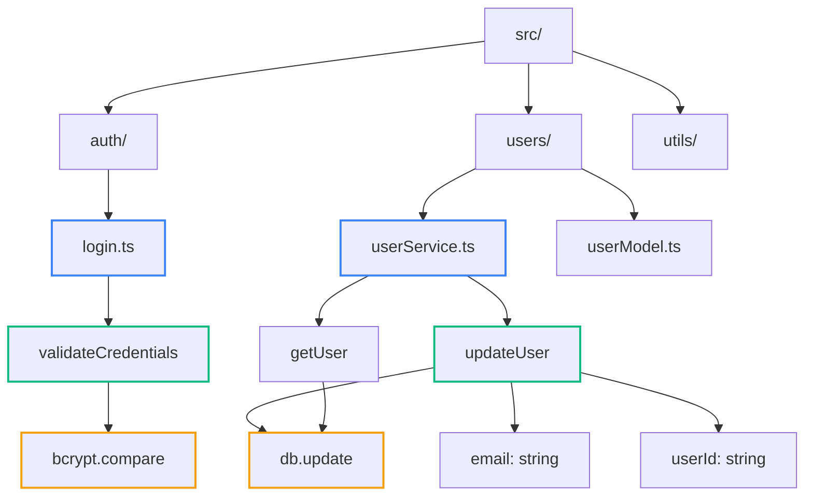
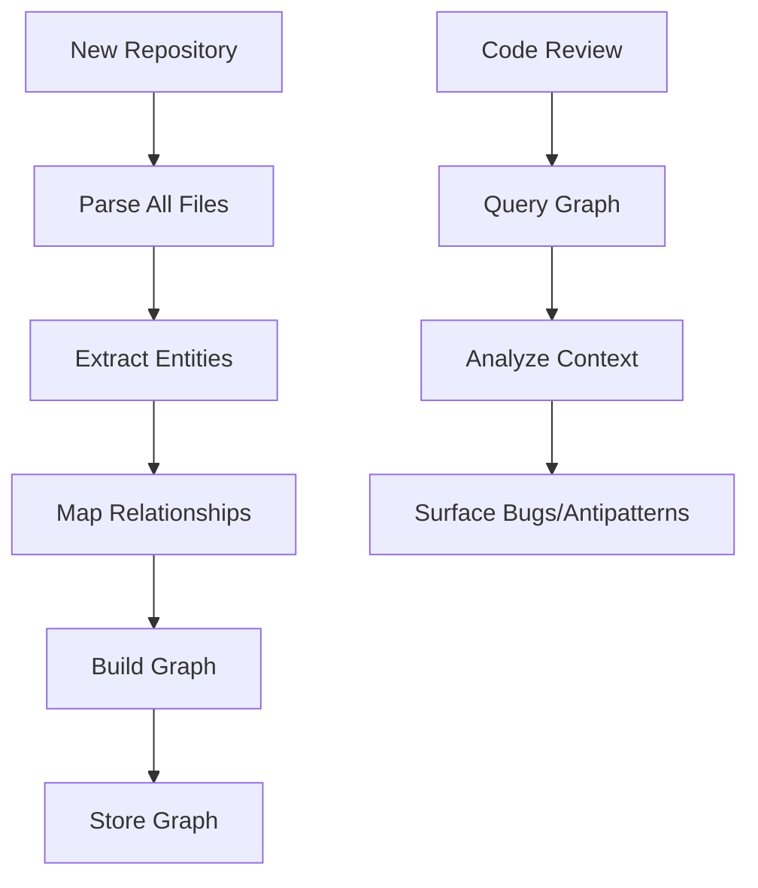
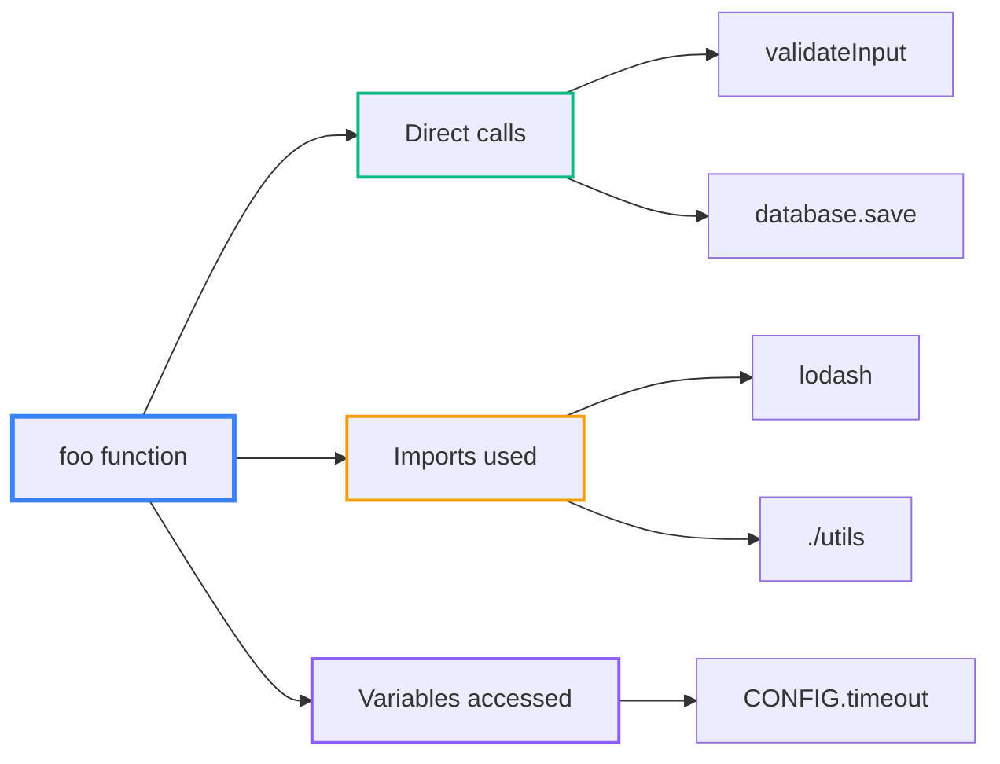

Greptile builds a complete graph of your codebase to understand how code changes affect other parts of your system, enabling context-aware code reviews that catch issues traditional tools miss.

## Why Codebase Context Matters

Most code review tools analyze files in isolation, missing critical relationships:

**Without Context:**
```typescript
// Reviewing this function alone
function updateUserEmail(userId: string, email: string) {
  return db.users.update(userId, { email });
}
// ❌ Misses: validation patterns, error handling, related functions
```

**With Context:**
```typescript
// Greptile sees the bigger picture
function updateUserEmail(userId: string, email: string) {
  return db.users.update(userId, { email });
  // ✅ Notices: other update functions validate input
  // ✅ Notices: similar functions handle errors  
  // ✅ Notices: email updates trigger notifications elsewhere
}
```

## Codebase Indexing

When you sign up, Greptile builds a complete graph of your repository containing every code element:



**Legend:** 🔵 Files • 🟢 Functions • 🟡 External calls/variables

### Indexing Process

<Steps>
<Step title="Repository Scanning">
Parses every file to extract directories, files, functions, classes, variables
</Step>

<Step title="Relationship Mapping">
Connects all elements: function calls, imports, dependencies, variable usage
</Step>

<Step title="Graph Storage">
Stores the complete graph for instant querying during code reviews
</Step>
</Steps>



## How Greptile Analyzes Functions

When reviewing a changed function `foo(x)`, Greptile queries the graph to understand:

### 1. Function Dependencies



### 2. Function Usage

```typescript
// Greptile finds everywhere foo() is called
function foo(x: string) {
  return processData(x);
}

// Usage sites discovered:
// ✅ components/UserForm.tsx:45  
// ✅ services/DataService.ts:12
// ✅ tests/integration.test.ts:78
// → Impact analysis: changes will affect 3 files
```

### 3. Pattern Consistency

```typescript
// When reviewing this SQL function:
function getUserById(id: string) {
  return db.query('SELECT * FROM users WHERE id = $1', [id]);
}

// Greptile checks other SQL functions:
// ✅ getUserByEmail() - uses parameterized queries ✓
// ❌ getOrderById() - uses string concatenation ⚠️  
// → Suggests: "Use parameterized queries like other DB functions"
```

### Real-time Graph Queries

Every time a file is reviewed, Greptile queries the pre-built graph:

```typescript
// When reviewing this change:
function updateUserProfile(userId: string, data: UserData) {
  // New code being reviewed
}

// Greptile instantly knows:
// 📍 Import dependencies: UserData interface, validation utils
// 📍 Function calls: database.update(), validateUserData()  
// 📍 Callers: ProfileController.update(), AdminPanel.updateUser()
// 📍 Similar patterns: updateUserEmail(), updateUserSettings()
```

## Why This Approach Works

<Card title="Complete Context" icon="circle-nodes" horizontal>
Reviews consider the entire codebase, not just changed files
</Card>

<Card title="Pattern Recognition" icon="magnifying-glass" horizontal>
Finds inconsistencies and suggests improvements based on existing code
</Card>

<Card title="Impact Analysis" icon="radar" horizontal>
Identifies all code that could be affected by changes
</Card>

The graph-based approach transforms code review from isolated file analysis into comprehensive system understanding, catching issues that would otherwise slip through traditional reviews.

