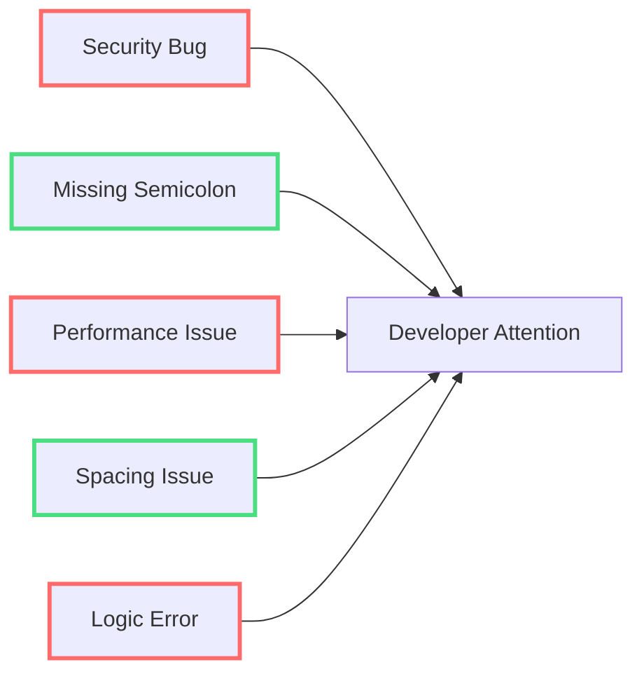
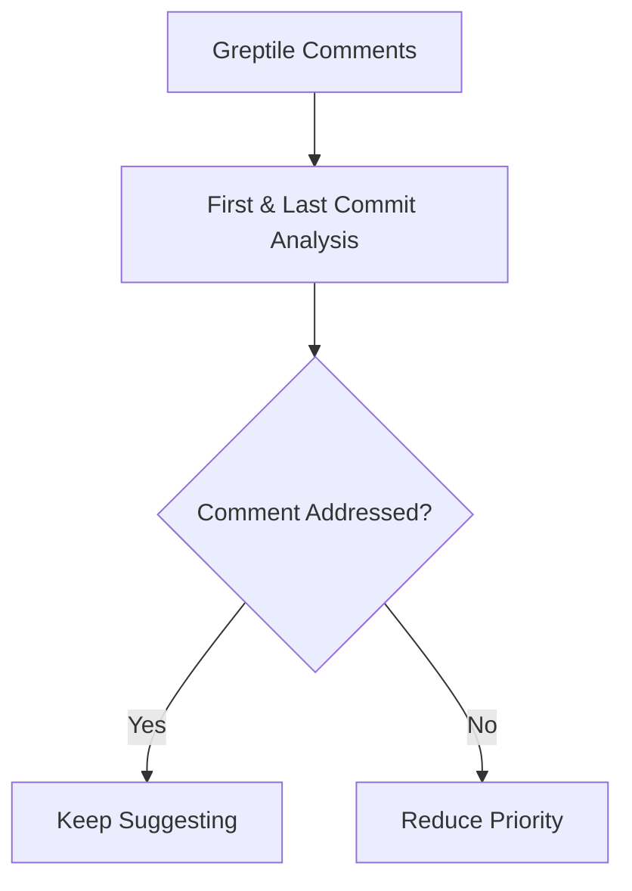
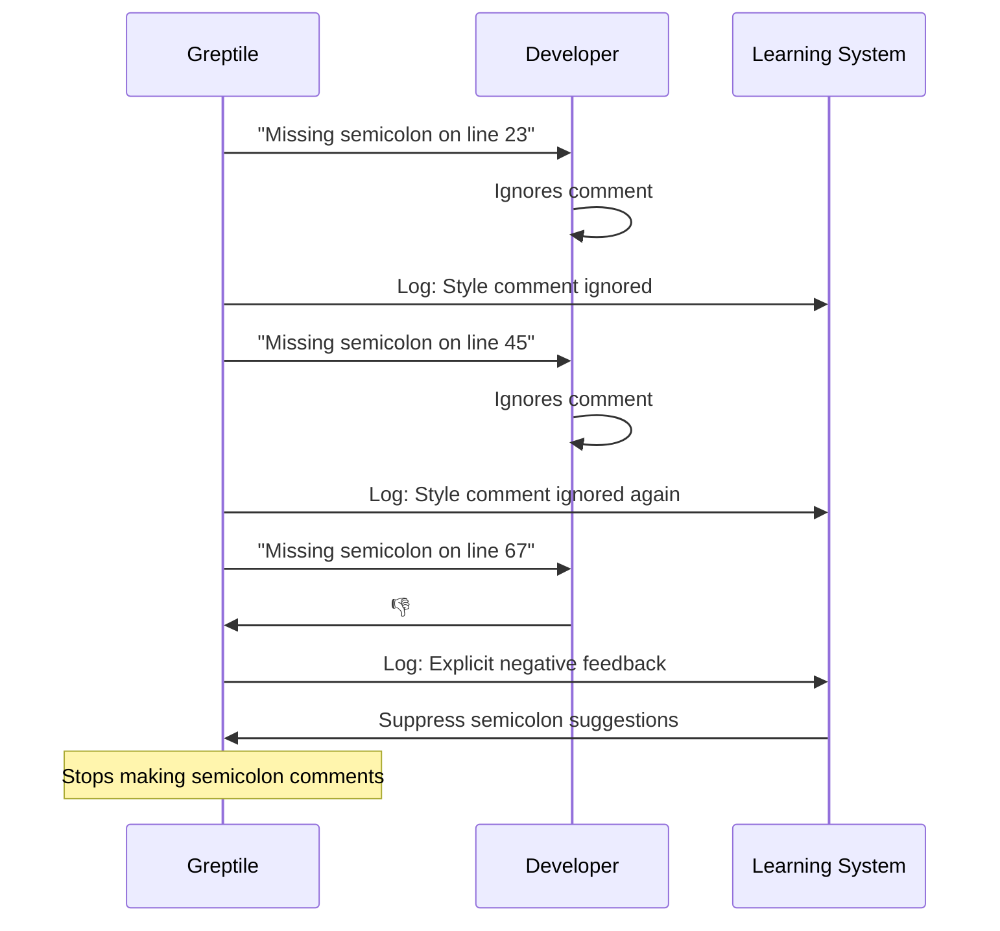
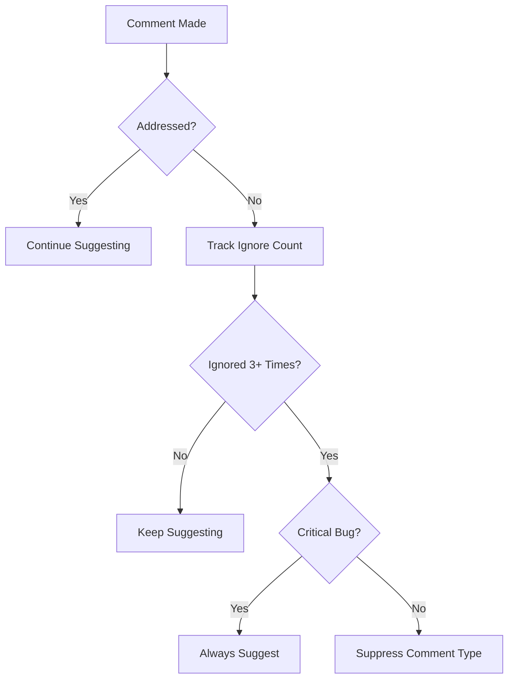

Greptile learns to eliminate nitpicky comments that distract developers from critical issues by analyzing which suggestions your team actually acts on.

## The Nitpick Problem

Nitpicks are minor suggestions that distract from critical issues:



**Problem**: Developers focus on easy-to-fix style issues while missing critical bugs.

## How Greptile Learns to Filter Noise

### 1. Commit Analysis

Greptile reads the **first** and **last** commit of every PR to see which comments were addressed:



### 2. Learning from Reactions

Thumbs up/down reactions provide immediate feedback:

<Tabs>
<Tab title="👍 Thumbs Up">
```
Greptile: "Consider adding error handling here"
Developer: 👍 (implements the suggestion)
→ Greptile learns: "Error handling suggestions are valuable"
```
</Tab>

<Tab title="👎 Thumbs Down">
```
Greptile: "Add semicolon at end of line"
Developer: 👎 (ignores consistently)
→ Greptile learns: "This team doesn't care about semicolons"
```
</Tab>
</Tabs>

### 3. Learning Examples

**Example 1: Style Comments Get Filtered**



**Example 2: Critical Issues Always Surface**

```typescript
// Greptile will ALWAYS comment on this (even if team ignores style):
function transferMoney(amount, account) {
  // No input validation - SECURITY RISK
  database.transfer(amount, account);
}

// But stops commenting on this after learning:
const user = getUser()  // Missing semicolon - but team doesn't care
```

## Learning Thresholds

Greptile stops making certain types of comments based on team behavior:



### What Gets Suppressed vs. What Doesn't

<AccordionGroup>
<Accordion title="✅ Gets Suppressed (if consistently ignored)">
- Style/formatting issues
- Import organization
- Missing documentation (non-critical)
- Naming convention deviations
- Code organization preferences
</Accordion>

<Accordion title="🚫 Never Gets Suppressed">
- Security vulnerabilities
- Memory leaks
- Infinite loops
- Null pointer exceptions
- Data validation missing from user inputs
</Accordion>
</AccordionGroup>

## The Result: Focused Reviews

**Before Learning:**
```
PR #123 - Add user authentication
├── 🔴 Missing input validation (CRITICAL)
├── 🟡 Consider adding error handling
├── 🟢 Missing semicolon on line 45
├── 🟢 Inconsistent indentation
├── 🟢 Import order could be improved  
├── 🟢 Function could use better name
└── 🟢 Missing JSDoc comment
```

**After Learning (Team ignores style issues):**
```
PR #123 - Add user authentication  
├── 🔴 Missing input validation (CRITICAL)
└── 🟡 Consider adding error handling
```

## Why This Matters

<Card title="Reduced Noise" icon="volume" horizontal>
Fewer distracting comments mean developers focus on what matters
</Card>

<Card title="Faster Reviews" icon="clock" horizontal>
Less time spent on trivial issues, more on logic and architecture
</Card>

<Card title="Better Adoption" icon="thumbs-up" horizontal>
Teams are more likely to act on focused, relevant suggestions
</Card>

<Card title="Adaptive AI" icon="brain" horizontal>
The system becomes more valuable over time as it learns your preferences
</Card>

